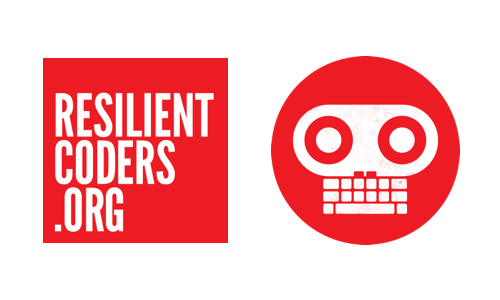

# Resilient Coders Playbook  

# Hacking The Opportunity Gap
## Spreading code literacy to young people from traditionally undeserved communities

### Lab policies
[Core Values](core-values.md)  
[Safe Space Policy](safe-space.md)  
[Anti-Harassment Policy](harassment.md)

### Development

***Style Guides***
[HTML Style Guide](html-style.md)  
[CSS && SCSS Style Guide](css-style.md)  
[Javascript Style Guide](js-style.md)  

***Setup && Workflow***

[Github Workflow](github.md)  
[Jekyll Setup w/ Vagrant](jekyll.md)

The text of this playbook is licensed under a [Creative Commons Attribution-ShareAlike 4.0 International License](http://creativecommons.org/licenses/by-sa/4.0/).  
The Resilient Coders logo and slogans do not fall under this license.
